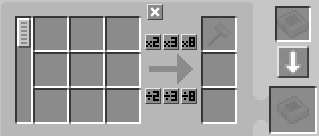
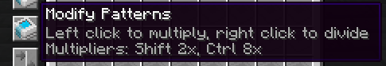

---
navigation:
  parent: expandedae-index.md
  title: QoL Features
  icon: expandedae:exp_pattern_provider
  position: 10
categories:
  - expandedae
---

# The mod adds all the QoL features listed below
## Encoding Terminal features
### Shift clicking when encoding a pattern moves it to your inventory
### In-terminal multiplication buttons

## Pattern Multiplication in Pattern Providers: This adds a button to the Pattern Provider which allows you to either multiply or divide all the contained Patterns 
__The multipliers do stack!__

## Extra Blocking modes: This adds two extra blocking modes to all Pattern Providers
### Default: This is the default blocking mode by ae2, it will push the pattern if the connected storage does not contain any of the pattern inputs in this Pattern Provider, if the storage contains  anything that is not a pattern input, the blocking mode will skip it and still push the pattern. 
    

### Full: This blocking mode will not push the pattern if the connected storage contains anything. 
    

### Smart: Allows the Pattern Provider to push the same pattern if the target storage only contains the inputs from this specific pattern 

